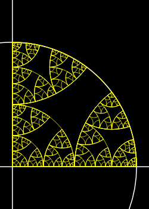

## Math Notebook (2024)

I love learning about math for the purpose of creating art. I wanted a place to 
explore mathematical ideas in code, as some things are too tedious to do by
hand.

This repo is intended mainly for learning and sometimes making art. The code
isn't guaranteed to be production quality and may change without notice.

## Running Examples

```
cargo run --example <example_name>
```

Will run one of the example programs, `<package>/examples/<example_name>.rs`

## Möbius Transformations and Complex Numbers



I'm re-reading the book _Indra's Pearls: The Vision of Felix Klein_ 
by David Mumford, Caroline Series and David Wright. This book talks
about the geometry of Möbius transformations. These are any sequence of
translations, rotations, uniform scaling, and complex inversion (which is 
actually more like a fancy 180° rotation). The book goes on to show how these
can be used to make all sorts of interesting fractal patterns.

The `mobius` package implements these transformations and lets me do my own
explorations. This includes exporting SVG images.

So far I have a couple example programs to generate some fractals like the
image above.

## Permutations

The `permutations` package explores permutations for a finite number of
elements. In particular, I'm interested in trying to understand twisty puzzles
and the group theory behind them.

Right now the only example is computing the Cayley table for the octahedral
rotation group (the rotation symmetries of an octahedron or cube). This is
one small subproblem in understanding e.g. a 2x2x2 cube.

## Repo Layout

I'm reorganizing the repo. READMEs still in progress, but you can find
them in the respective folders

- [`abstraction`](./abstraction/README.md) - Traits for abstract math concepts
- [`mobius`](./mobius/README.md) - complex numbers and Mobius transformations
- [`permutations`](./permutations/README.md) - permutations
- [`symbolic`](./symbolic/README.md) - symbolic computation, mostly geometric algebra stuff so far
- [`geometric_algebra`](./geometric_algebra/README.md) - Geometric Algebra ⚠️Needs cleanup